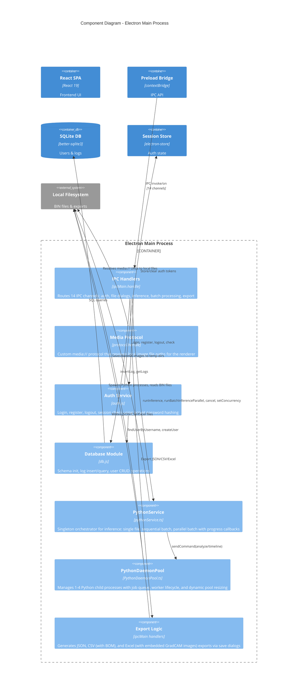

# Component Diagram - Electron Main Process

The component diagram shows the internal structure of the Electron Main Process and how its components interact.

## Component Descriptions

| Component | File | Responsibility |
|-----------|------|----------------|
| **IPC Handlers** | `index.ts` | Registers 14 `ipcMain.handle` channels that bridge renderer requests to backend services |
| **Media Protocol** | `index.ts` | Custom `media://` protocol handler that translates image URLs to local file paths, handling Windows drive letter edge cases |
| **Auth Service** | `services/auth.js` | User authentication with bcrypt password hashing, session management via electron-store |
| **Database Module** | `database/db.js` | SQLite schema initialization, CRUD for `users` and `system_logs` tables |
| **PythonService** | `services/pythonService.ts` | Singleton that orchestrates all inference operations: single-file, sequential batch, and parallel batch with semaphore-based concurrency control, progress streaming, and cancellation support |
| **PythonDaemonPool** | `utils/PythonDaemonPool.ts` | Manages a pool of persistent Python child processes (1-4), with stdin/stdout JSON communication, job queuing, worker health monitoring, and dynamic pool resizing |
| **Export Logic** | `index.ts` (inline) | Generates three export formats: raw JSON, CSV with BOM for Excel compatibility, and XLSX with embedded GradCAM overlay images using ExcelJS |
