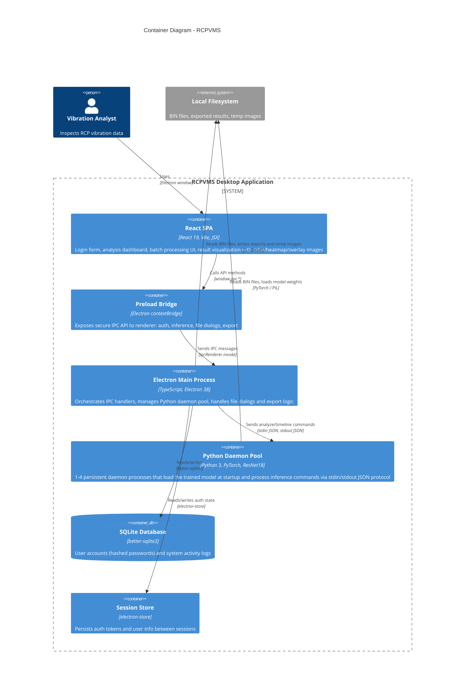

# Container Diagram - RCPVMS

The container diagram shows the major deployable/runnable units inside RCPVMS and how they communicate.

## Container Descriptions

| Container | Technology | Responsibility |
|-----------|-----------|----------------|
| **React SPA** | React 19, Vite | Login/register form, model inference UI (single + batch), result display with orbit images, heatmaps, GradCAM overlays, export controls |
| **Preload Bridge** | Electron contextBridge | Security boundary that exposes a curated `window.api` object to the renderer, mapping method calls to IPC invocations |
| **Electron Main Process** | TypeScript, Electron | Central orchestrator: registers IPC handlers for auth, file selection, inference, batch processing, concurrency control, and result export (JSON/CSV/Excel with images) |
| **Python Daemon Pool** | Python, PyTorch, ResNet18 | 1-4 persistent child processes that pre-load the trained ResNet18 model at startup (eliminating cold-start latency), receive commands via stdin JSON, and return results via stdout JSON. Supports parallel batch inference with configurable concurrency |
| **SQLite Database** | better-sqlite3 | Stores `users` table (username, hashed password) and `system_logs` table (action, details, timestamp) |
| **Session Store** | electron-store | File-based key-value store for persisting auth tokens and user info across app restarts |
