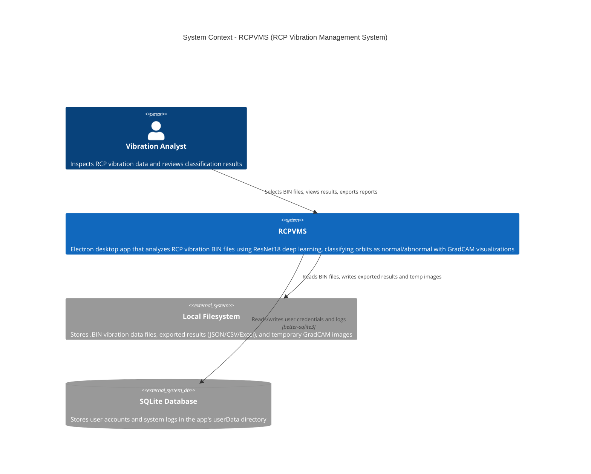

# System Context - RCPVMS

The system context diagram shows RCPVMS and its interactions with users and external systems.

**RCPVMS** is an Electron desktop application for analyzing RCP (Reactor Coolant Pump) vibration data (.BIN files) using a ResNet18 deep learning model. It classifies each of the 4 RCP orbits (RCP1A, RCP1B, RCP2A, RCP2B) as normal or abnormal, and provides GradCAM visualizations for interpretability.

## Key Interactions

| From | To | Description |
|------|-----|-------------|
| Analyst | RCPVMS | Selects BIN files (single or batch), views inference results with overlays, exports to JSON/CSV/Excel |
| RCPVMS | Filesystem | Reads .BIN vibration data, writes exported analysis reports and temporary GradCAM visualization images |
| RCPVMS | SQLite | Manages user accounts (registration, login) and system activity logs |
