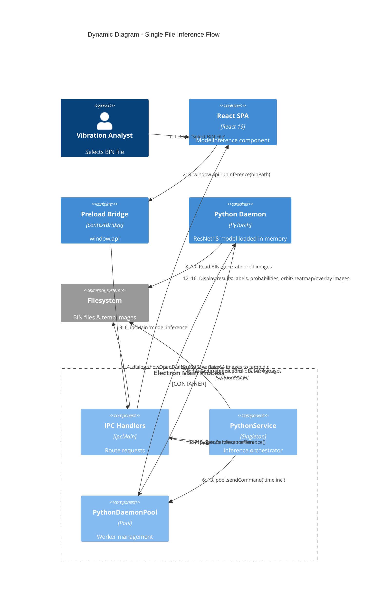
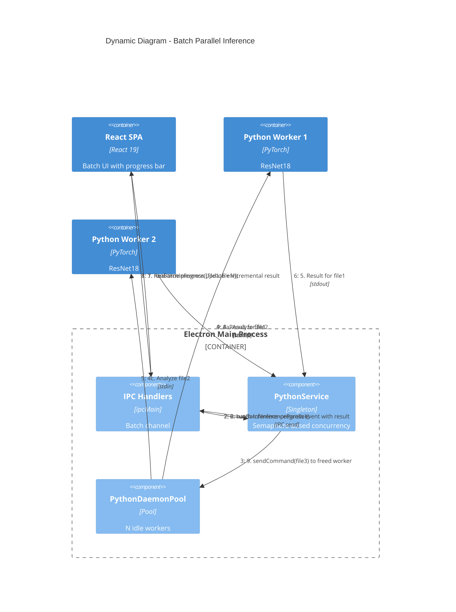

# Dynamic Diagram - Single File Inference Flow

Shows the step-by-step request flow when an analyst selects a BIN file and runs inference.

## Flow Description

| Step | Action | Detail |
|------|--------|--------|
| 1-4 | **File Selection** | User clicks select button, Electron shows native file dialog, returns `.BIN` file path |
| 5-8 | **Inference Request** | Renderer calls `runInference` via IPC, PythonService routes to DaemonPool |
| 9-11 | **Python Processing** | Daemon reads BIN, generates 4 orbit images (RCP1A/1B/2A/2B), runs ResNet18 prediction + GradCAM, returns JSON with Base64-encoded images |
| 12 | **Image Persistence** | PythonService decodes Base64 images to temp files so renderer can display them via `media://` protocol |
| 13-14 | **Timeline Generation** | Second daemon command generates temporal orbit images for animation |
| 15-16 | **Result Display** | Final `InferenceResult` returned to renderer: final_label (normal/abnormal), per-RCP predictions with probabilities, visualization paths |

---

# Dynamic Diagram - Batch Parallel Inference Flow

Shows how batch inference processes multiple BIN files in parallel using the daemon pool.

## Parallel Processing Details

- **Concurrency Control**: Semaphore pattern limits concurrent jobs to `maxConcurrent` (1-4, configurable at runtime)
- **Pool Resizing**: `setConcurrencyLevel()` dynamically adjusts the number of Python daemon workers
- **Progress Streaming**: Each completed file triggers an IPC `send` event with incremental results (not just counts)
- **Cancellation**: `AbortController` allows mid-batch cancellation; in-flight jobs complete but no new jobs start
- **Memory Optimization**: Final batch result returns only success/failure summary; full results are streamed incrementally
